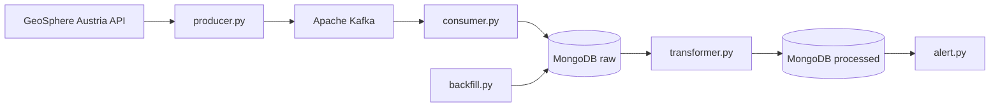

# Weather Monitoring System — Carinthia, Austria

A real-time data engineering pipeline that collects, processes, and monitors weather data from 5 meteorological stations in Carinthia (Kärnten), Austria, using the GeoSphere Austria API.

## Architecture


## Monitored Stations

### Station ID	Name	Region
6	Bad Bleiberg	Kärnten
62	Millstatt	Kärnten
100	Villach Stadt	Kärnten
150	Spittal an der Drau	Kärnten
19911	Hermagor	Kärnten

### Prerequisites
Python 3.10+
Docker Desktop
Git

## Installation & Setup
### 1. Clone the repository
git clone https://github.com/your-username/Data_Engineering_Project.git
cd Data_Engineering_Project
### 2. Install Python dependencies
pip install -r requirements.txt
### 3. Configure environment variables
Copy the example file and fill in your values:

cp .env.example .env
Edit .env:

MONGO_URI=mongodb://localhost:27017/
MONGO_DB=city_database
MONGO_COLLECTION_RAW=weather_data
MONGO_COLLECTION_PROCESSED=weather_processed
MONGO_COLLECTION_ALERT=alert_collection
KAFKA_BROKER=localhost:9092
KAFKA_TOPIC=weather_raw
### 4. Start Docker services
docker compose up -d
This starts MongoDB and Apache Kafka.

## Configuration
All pipeline settings are managed in config/config.yaml:

API endpoint and interval
Station IDs and names
Weather parameters to collect
Quality flags for data validation
Alert thresholds for each parameter
Example alert thresholds:

alerts:
  temperature:
    max: 35    # Heat warning above 35°C
    min: -15   # Cold warning below -15°C
  wind:
    ffam_max: 60   # Storm warning above 60 km/h
    ffx_max: 90    # Extreme gusts above 90 km/h
  precipitation:
    rr_max: 30     # Heavy rain above 30 mm/10min
  snow:
    sh_max: 100    # Snow depth above 100 cm

## Running the Pipeline
Each component runs independently. Start them in separate terminals:

### Live data collection

```bash
# Terminal 1 — fetch data from GeoSphere API and send to Kafka
python src/producer.py

# Terminal 2 — consume from Kafka and store raw data in MongoDB
python src/consumer.py

# Terminal 3 — transform raw data into flat records
python src/transformer.py

# Terminal 4 — monitor for weather threshold violations
python src/alert.py

## Historical backfill (run once)
Loads the last 6 months of historical data directly into MongoDB:

python src/backfill.py
**Note:** The backfill is an academic requirement for the IU Data Engineering project.
The backfill automatically splits the request into 30-day chunks to stay within the GeoSphere API limit of 1,000,000 values per request.
```

## Alert System
alert.py monitors the latest measurement per station and fires alerts when thresholds are exceeded. It uses a state machine to avoid duplicate notifications:

WARNUNG: fired once when a threshold is first exceeded
ENTWARNUNG: fired when the value returns to the normal range
No repeated alerts while a threshold remains exceeded
All alerts are stored in the alert_collection MongoDB collection with active: true/false.

## Project Structure
Data_Engineering_Project/
├── config/
│   └── config.yaml          # Pipeline configuration & alert thresholds
├── src/
│   ├── producer.py           # Fetches API data → Kafka
│   ├── consumer.py           # Kafka → MongoDB (raw)
│   ├── transformer.py        # MongoDB raw → MongoDB processed
│   ├── backfill.py           # Historical data loader (6 months)
│   └── alert.py              # Threshold monitoring & alerting
├── tests/
│   ├── conftest.py           # Pytest fixtures
│   ├── test_transformer.py   # Unit tests for transform_document()
│   └── test_backfill.py      # Unit tests for get_limits()
├── .env                      # Environment variables (not committed)
├── .env.example              # Environment variable template
├── docker-compose.yml        # MongoDB + Kafka services
└── README.md

## Running Tests
pytest tests/

## Data Source
Weather data is provided by GeoSphere Austria via the [GeoSphere Austria Data Hub](https://data.hub.geosphere.at/).

Endpoint: klima-v2-10min (10-minute historical climate data)
API limit: 1,000,000 values per request
Rate limit: 5 requests/second, 240 requests/hour

## Known Improvements
- Centralize MongoDB connections in `db_connections.py`

## Academic Context
This project was developed as part of the Project: Data Engineering module at [IU International University of Applied Sciences](https://www.iu.de/).